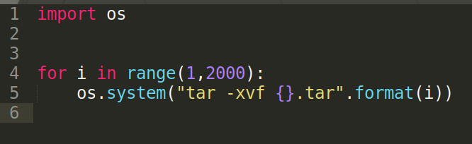
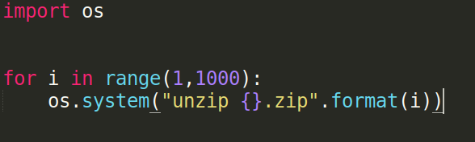
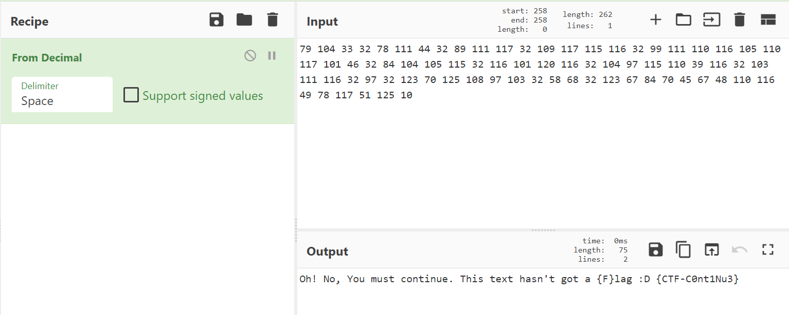
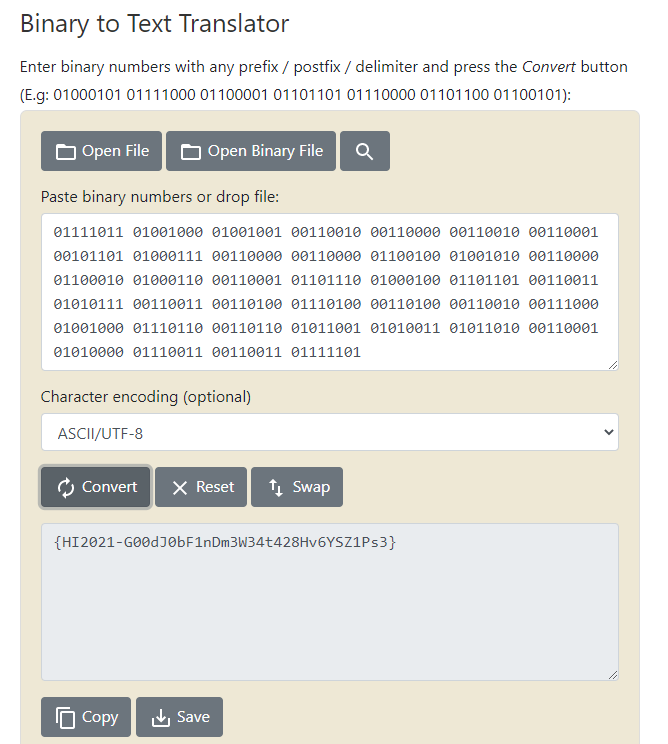

## B2B21
#
Soruda bize b2b21.tar verilmişti. Tar'ı açtığımızda 2.tar çıktı daha sonra ondan ise 3.tar çıktı. Burdan içiçe birçok tar'ın olduğunu anladık ve bunun için bir script yazmaya karar verdik.



Çalıştırdığımızda 2.tar'dan 1232.tar'a kadar olan tar'lar ve CTF_flg adında bir dizin çıktı.

Dizinin içinde de ascii.pdf.gpg, A'dan N'ye kadar harflerle adlandırılmış dizinler ve her birinde 1.zip vardı.
Bu zipler için de benzer bi script yazdık



F dizini hariç diğerler dizinlerden flag.txt çıktı fakat içlerinde fake flagler vardı. Ama F dizininde 221.zip için şifre soruyordu ve içinde flag.exe olduğunu söylüyordu. Ordakinin gerçek flag olduğunu düşünüp john tooluyla 221.zip'i kırmayı denedik fakat başarılı olmadı. Daha sonra ascii.pdf.gpg'i de aynı şekilde john ile kırmayı denedik ve 

```
$ gpg2john ascii.pdf.gpg > hash

File ascii.pdf.gpg
[gpg2john] MDC is missing, expect lots of false positives!

$ sudo john hash

Using default input encoding: UTF-8
Loaded 1 password hash (gpg, OpenPGP / GnuPG Secret Key [32/64])
Cost 1 (s2k-count) is 14155776 for all loaded hashes
Cost 2 (hash algorithm [1:MD5 2:SHA1 3:RIPEMD160 8:SHA256 9:SHA384 10:SHA512 11:SHA224]) is 2 for all loaded hashes
Cost 3 (cipher algorithm [1:IDEA 2:3DES 3:CAST5 4:Blowfish 7:AES128 8:AES192 9:AES256 10:Twofish 11:Camellia128 12:Camellia192 13:Camellia256]) is 3 for all loaded hashes
Note: This format may emit false positives, so it will keep trying even after
finding a possible candidate.
Proceeding with single, rules:Single
Press 'q' or Ctrl-C to abort, almost any other key for status
Almost done: Processing the remaining buffered candidate passwords, if any.
Proceeding with wordlist:/usr/share/john/password.lst, rules:Wordlist
princess         (?)
```

Bu şifreyle gpgyi decrypt ettik.

```
$ gpg --ignore-mdc-error --decrypt ascii.pdf.gpg

gpg: CAST5 şifreli veri
gpg: 1 anahtar parolası ile şifrelenmiş
79 104 33 32 78 111 44 32 89 111 117 32 109 117 115 116 32 99 111 110 116 105 110 117 101 46 32 84 104 105 115 32 116 101 120 116 32 104 97 115 110 39 116 32 103 111 116 32 97 32 123 70 125 108 97 103 32 58 68 32 123 67 84 70 45 67 48 110 116 49 78 117 51 125 10
gpg: UYARI: ileti bütünlük korumalı değildi
```
Çıkan sonucu CyberChef sitesinde kırınca bize bir hint verdi.




Hintin sonunda yazanın zip şifresi olup olmadığını denedik ve oldu

```
$ unzip 221.zip 

Archive:  221.zip
[221.zip] flag.exe password: CTF-C0nt1Nu3
  inflating: flag.exe
```
Strings komuduyla flag.exe ye bakınca bize bir binary verdi.

```
$ strings flag.exe 

01111011 01001000 01001001 00110010 00110000 00110010 00110001 00101101 01000111 00110000 00110000 01100100 01001010 00110000 01100010 01000110 00110001 01101110 01000100 01101101 00110011 01010111 00110011 00110100 01110100 00110100 00110010 00111000 01001000 01110110 00110110 01011001 01010011 01011010 00110001 01010000 01110011 00110011 01111101
```
Son olarak binary'i text'e çevirdiğimizde flagi elde ediyoruz


