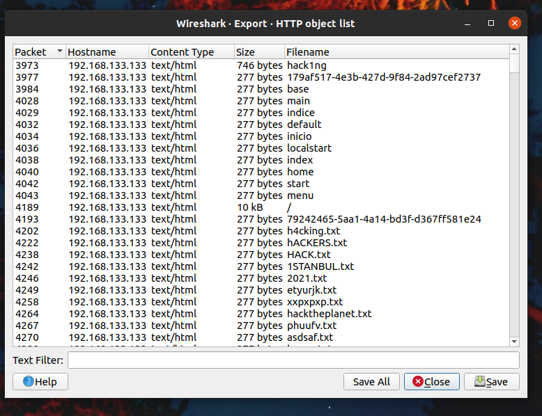
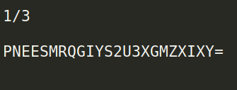
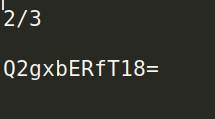
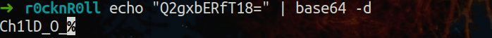
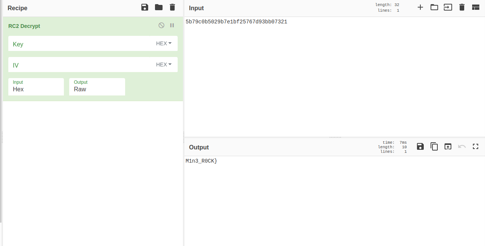

# R0ck'n Roll

Soruda bize R0cknR0ll adlı bir pcap dosyası veriliyordu. Hemen dosyayı wireshark ile açıp incelemeye başladım.

Dosyayı açar açmaz birçok HTTP requesti olduğunu ve birçok requestin responselarinin aynı uzunlukta olduğunu fark ettim.Dolayısıyla HTTP requestlerini uzunluklarına göre sıralamak ve dışa aktarmak için Wireshark'ın `HTTP Object List` fonksiyonunu kullandım.Böylelikle paket numarası, response uzunluğu, host, path gibi değelerlere sıralı olarak ulaşmış olduk.

Birçok requestin responsesu 277 byte uzunluğundaydı ve herhangi birini indirip açtığımda serverin 404 not found göndüğünü gördüm.Bende requestleri response uzunluklarına göre sıraladım ve farklı olanları indirdim.Dosyaları incelerken `guns.txt` dosyasında 1/3 yazısını ve encrypted bir değer olduğunu gördüm.

Bunun flagin 1/3 ünün şifrelenmiş hali olduğunu düşündüm ve flagin geri kalanının şifrelenmiş halini elde etmek için diğer dosyaları inceledim.Flagin geri kalanının and.txt ve roses.txt dosyalarında olduğunu gördüm.

Sırada bu encrypted değerleri decrypt etmek vardı.Hemen ilk değeri base32 olarak decrypt ettim ve flagin 1/3'ünü elde etmiş oldum.

Hemen ardından ikinci değeri base64 olarak decrypt ettim ve flagin 2/3 ünü elde etmiş oldum.

Uzun bir süre son değerin md5 olduğunu sandık ve ilerleyemedik.Uzun bir süre sonra bunun bir rc2 yöntemiyle şifrelenmiş bir değer olduğunu fark ettik.Cybershef yardımıyla hızlıca decrypt ettik ve flagin tamamını elde ettik.

Flag: {HI2021-Sw33t_Ch1lD_O_M1n3_R0CK}
