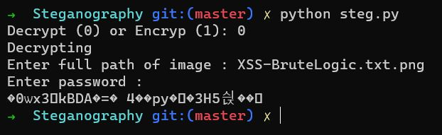

## XSS-BruteLogic 
#
XSS-BruteLogic sorusunda bize XSS-BruteLogic.zip adlı bir zip dosyası veriyordu. Bunu unzip ettiğimiz zaman bize .git/ dizini ve XSS-BruteLogic.txt.png adlı bir dosya verdi. XSS-BruteLogic.txt.png dosyasına file attığımız zaman bize bir PNG dosyası olduğunu gösterdi. 

XSS-BruteLogic.txt.png resmini açtığımız zaman bizim işimize yarayacak bir görüntü ortaya çıkmadı. .git/ dizinine geçtiğimiz zaman git diff ve git log komutlarından bir bilgi elde edemedik. Config dosyasını okudğumuz zaman https://github.com/Effective1212/Steganography.git bir Github repositorysi verdi. Bu github reposunu clone ettik ve içerisinde opencv ile yazılmış bir steg.py adında bir python scripti gördük. Bu scripti python2 ile çalıştırdık sebebi syntaxi python2 ye göre yazılmasıydı. Scripti çalıştırıp decrypt etmeye çalışırken bizden bir key istedi.

Denemelerimizden sonra buraya bruteforce karar verdik fakat elimizdeki çoğu liste işe yaramadı. XSS-BruteLogic kelimseini Google'da aradığımız zaman ilk çıkanlardan https://github.com/swisskyrepo/PayloadsAllTheThings/blob/master/XSS%20Injection/Intruders/BRUTELOGIC-XSS-STRINGS.txt böyle bir Github linki çıkıyordu. Sonrasında bu txt dosyası içerisindeki payloadları steg.py dosyasına key olarak verecek bir script yazdık. Fakat python scriptinde AES decrypt modu bulunmuyordu bunun için kendimiz var olan tüm modları denedik. Bu scripti çalıştırdıktan sonra ECB moduyla bu keyi elde ettik `'-alert(1)-'` ve keyimizi yazdıktan sonra fotoğrafı başarıyla decrypt etmiş olduk.

