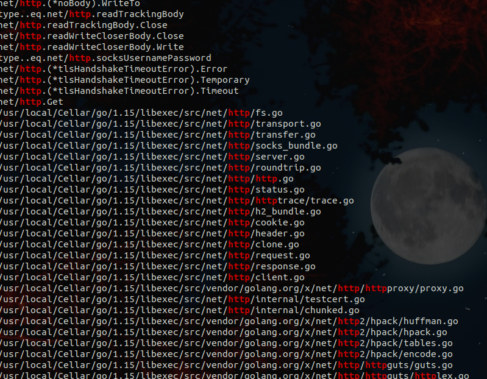
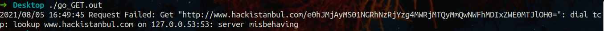
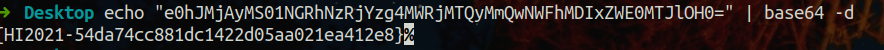

# go_GET

Soruda bize bir adet binary vermiş ve flagi bulmamızı istiyor.

İsminden yola çıkarak bunun go ile yazılmış ve compile edilmiş bir binary olduğunu düşündüm.Ayrıca içerisinde `GET` geçtiği için binarynin biryerlere http requesti atacağını tahmin ediyordum.Hemen `strings go_GET.out | grep "http"` komutunu kullanarak, binarydeki okunabilir değerler içersinde httpyi aradım ve tahminimde haklı çıktığımı gördüm.

Binarynin nereye request attığını bularak flage ulaşabileceğimi düşündüm.Bunun için binarye proxy bağlamak yeterli olacaktır.

CTF esnasında soruyu hızlı çözmek adına internet bağlantımı kesip binaryi çalıştırdığımda request atamayacağını ve error kodunda adersin sızdırılacağını düşündüm.İnternet bağlantımı kestim ve binaryiyi çalıştırdım.Böylelikle requestin atılacağı URL'i buldum.

Request hackistanbul.com adresine gidiyordu ve requestin pathinde bir base64 değer vardı.Bu değeri base64 olarak decode ettim ve flagi aldım.

Flag: {HI2021-54da74cc881dc1422d05aa021ea412e8}
